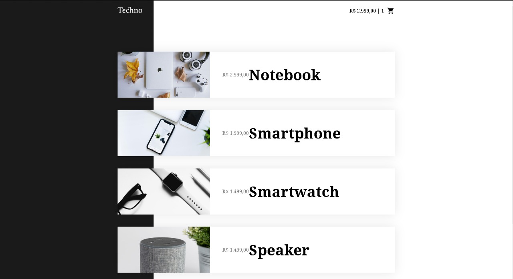
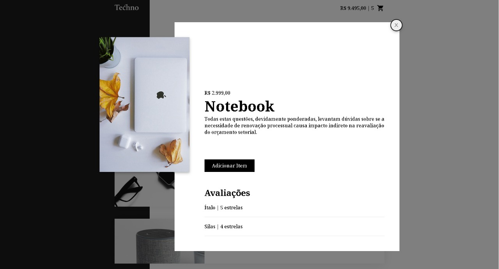
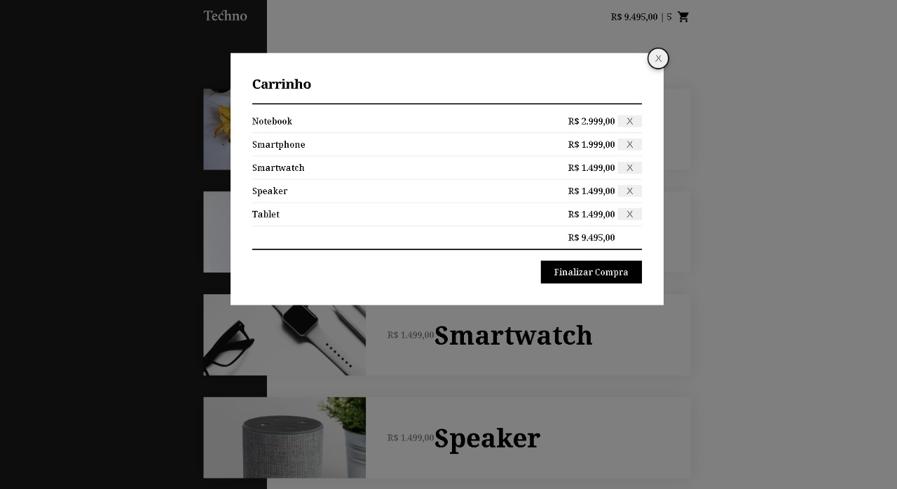

<div>
    <h1 align="center">
        
    </h1>
</div>

<div align="center">
    <h2> 🚀 Techno - Origamid </h2>
</div>

<p align="center">
  <a href="#rocket-tecnologias">Tecnologias</a>&nbsp;&nbsp;&nbsp;|&nbsp;&nbsp;&nbsp;
  <a href="#-projeto">Projeto</a>&nbsp;&nbsp;&nbsp;|&nbsp;&nbsp;&nbsp;
  <a href="#wrench-instalação-e-uso">Instalação e uso</a>&nbsp;&nbsp;&nbsp;|&nbsp;&nbsp;&nbsp;
</p>

</br>

<div align="center">
  
</div>

## 👨🏼‍💻 Desenvolvedor 

- [Ítalo Henrique](https://www.linkedin.com/in/italo-tech/)

## :rocket: Tecnologias

Esse projeto foi desenvolvido com a seguinte tecnologia:

- [HTML](https://devdocs.io/html/)
- [CSS](https://devdocs.io/css/)
- [Vuejs](https://vuex.vuejs.org/)

## 💻 Projeto

Techno é meu primeiro projeto com vuejs que visa em ser um e-commerce voltado para compras de produtos eletrônicos.

<div align="center">
  
  
</div>

## :wrench: Instalação e uso

Para rodar a aplicação, você precisa ter o [Node](https://nodejs.org/en/) instalado em sua máquina e seguir os passos abaixo:

1) Abra um terminal e copie este repositório com o comando
    ```
    git clone https://github.com/Italo-Tech/Techno
    ```
    ou use a opção de download.
    
2) Entre na pasta com
    ```
    cd techno
    ```

3) Instale as dependências
   
    ```
    yarn install
    ```
    
4) Rode a aplicação:
    ```
    yarn serve
    ```
    
5) Acesse ```http://localhost:3000``` no seu navagador.    

### Customize configuration
See [Configuration Reference](https://cli.vuejs.org/config/).
